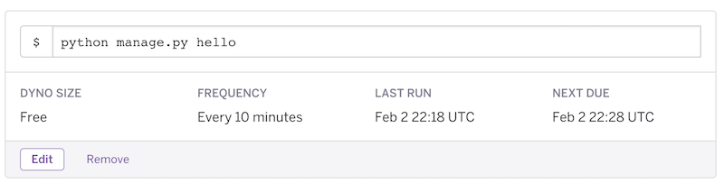
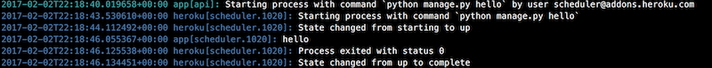

# Flask Heroku Scheduler

This repo is a template for Flask Heroku deployment of scheduled jobs.  We often run into the need to run "cronjob" like jobs on a server fr our machine learning pipelines. There are many ways to do this, but deploying to Heroku is the easiest. This code is supposed to be a template for how to do that quickly.

There are two files of interest for this app, the myapp.py, which contains a dummy web app that just returns simple text. This must be there because Heroku needs a web process to run.

The other file, manage.py, is more interesting. This is where you can define commands to be run either on-demand or by the scheduler. This file is written using flask-script, a lightweight management plugin for Flask. We have defined only one command in there, hello.  You can run it locally by typing:

```
python manage.py hello
```

If you have the Heroku CLI installed, you can type this instead:

```
heroku local:run python manage.py hello
```

This same job can be run on-demand on a deployed Heroku app by typing:

```
heroku run python manage.py hello
```

The scheduler uses this same interface to run. To use it, go to the web portal for your Heroku app and configure the [Heroku Scheduler plugin](https://devcenter.heroku.com/articles/scheduler) for your app.  Then just setup a job like below.



After running, you should see these lines in your Heroku logs. You can see these logs by simply typing:

```
heroku logs
```

